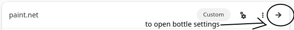
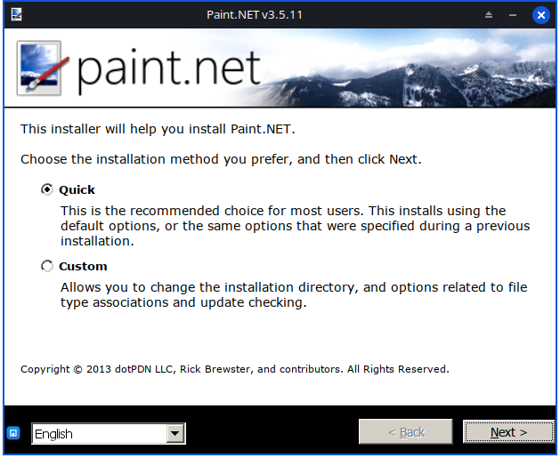
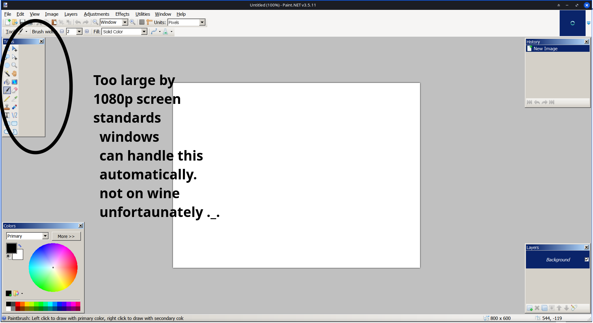

# Welcome to Paint.NET 3.5.11 in Bottles.

This project is all about HOW to run Paint.Net in linux.
This works with the latest version or maybe older version of bottles. Bottles is picked for a reason: its WAY simpler than wine AND i recommended USING it bc it does simpler setup than wine sooo..... LETS GET INTO IT!*

(*ALL WORK IS DONE VIA BOTTLES AND PAINT.NET NEEDS TO BE FOLLOWED BY THE RESPECTED AGREEMENTS PLZ DOTPDN LLC DONT BAN THIS PROJECT ITS OLD SOFTWARE ANYWAY...)

## okie dokie How to install bottles..
HARDNESS: very little

Just install flatpak in the link: [https://flathub.org/setup](https://flathub.org/setup)

then install bottles via this cmd: flatpak install com.usebottles.bottles

# install the full archive (recommended)

its ez just dump the archive via Import.. > Import a Bottle backup > /your/path/to/backup_paint.net.tar.gz

[](https://github.com/sainc-tech/paint.net-on-linux/releases)

its 500MB (heavy on 128gb SMOL on 1tb) but it does ALL MY SETUP MEANING yep dump the archive and boom setupe'd done out of the box.

# OR DIY config (manual so archive is recommended!)
if u want to screw the bottle, manual is an option! but its more setup but the full tar.gz does it out of the box sooo... full > manual by hardness of setup

## Requirements
Hardness: little i think..

uhm .net 2.0 and .net 3.5 and gdiplus from Dependencies tab on the bottle thats it.

### Q/A time!
its important bc this project exists JUST for one question.
Q: WHY? WE NEED SP1 INSTEAD OF NORMAL .NET 3.5 BC IT REQUIRED BY PAINT.NET 3.5.11!

A: well well well... INTRODUCING..... my reg file all it does is doing the .net 3.5
version to sp1 bc well sp1 is just tiny tweaks its .net 3.5 as the base tho 
why did i do this its a reason: THE INSTALLER OF NET 3.5 SP1 KEPT FAILING BY WINDOWS UPDATE HOOKS THAT WINE DOESNT HAVE SO I MADE THIS PROJECT TO HELP!
anyways...

## paint.net software
now this is the hard part listen, im giving u the software to install the LAST working version of paint.net so it works without scrambilng through the internet where some malware came some time so i recommend u install the one IN my repo for no malware so download it here.

# THE BOTTLES SETUP
Hardness: ez bc of my yaml file ;D

look at the part WHERE to get the bottle settings: 

OK DOKIE this is the part that works. This is the part where the program is set up first things first we install the regs bc we need the version change but do the requirements first bc we need the things installled first ok dokie


its time to setup stepbystep:
- create a custom bottle and do it on 32-bit if u see 64bit then change it to 32bit bc it works well than 64bit
- first get my .yml file bc it SETS EVERYTHING UP!
- second in my .yml file REPLACE add ur usrname here with linux username using find & replace in text editor <-- fun fact btw
- third IMPORT the .yml file main page > Import.. or Ctrl + I > Import a Bottle backup > Configuration
- fourth Add the reg via the registry editor
- fifth put this cmd: 
```bash
Paint.NET.3.5.11.Install.exe /x:C:\PDN_Extract 
```
(put it on drive_c dir using Browse C:/ drive > Browse.. bc it launches on drive_c)

### setup now
### OPEN THE -> ON THE BOTTLE to open the bottle..

this is the part WHERE u install the program in the bottle....
ADD the install program via " + Add Shortcuts.. " in the Bottle setings it creates a shortcut TO launch the exe the base program is added automatically thats why bottles > wine for setup reasons i mean its wine under the hood but theres soda as its runner THE better version of wine... the reason: its made by the bottles team specifically for gaming so paint.net v5 was HEAVY DIRECT2D AND DIRECTWRITE THAT WINE DIDNT HAVE BUT v3.5.11 WAS ONLY C++ and C# unmanaged code meaning FAST AND EZ ON WINE WHICH IS WHY THIS VERSION IS PICKED IN THE FIRST PLACE PLUS ALL GLITCHES IS GONE BC IT HAD MANY PATCHES AND THE LAST VERSION before v4 which is the gpu code that doesnt work on wine.

The image of setup:
  

set paint.net as normal way and its old soooo ahh colourful back then.
set .NET 2.0 and .NET 3.5 as normal.
thats it. finally bc my brain is forgetting fast...

### Disadvantages
- the windows theme is odd but u can change it via winecfg in command line in bottle tab install ur perferred .msstyle but i liked the windows 2000 theme..
- theres no thumbnail theres no fix if i tried it would take me 7 HOURS! to fix a thumbnail so screw it... no thumbnail fix i dont use thumbnails anyway...

## Thats it!
### result:


uhm 1% of code is ai .-. but its WEAK NOT LIKE THE PRO ONE IM IN FREE TIER!
done in 2 hrs! its too much..
put the repo via git (local) btw! meaning the improvements are ALL on me and my computer (Dell Latitude 7490)!
